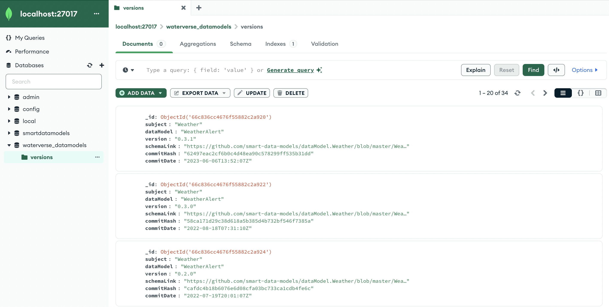

# SDM Versions Manager

## Overview

**sdm-versions-manager** is a Python-based service designed to create a database of Smart Data Models (SDMs) versions.

 It retrieves information about the current version of each data model and its corresponding hash code from a GitHub repository. 
 
 This service aims to facilitate the management and tracking of data model versions, ensuring that users have access to the most up-to-date information.

## Features

- Fetches historical commit data from GitHub for specified data models.
- Extracts version information and commit hashes from the schema files.
- Populates a MongoDB database with the historic and current versions of data models.
- Prevents duplicate entries in the database by checking existing records.

## Requirements

- Python 3.11 or higher
- MongoDB (local or hosted)
- GitHub personal access token (for API access)
- Required Python packages (listed in `requirements.txt`)

## Installation 

1. **Clone the repository**:

   ```bash
   git clone https://github.com/RihabFekii/sdm-versions-manager.git
   cd sdm-versions-manager
   ```

2. **Create a virtual environment (optional but recommended)**:
    ```bash
    python -m venv venv
    source venv/bin/activate
    ```  

3. **Install the required packages**:
    ```bash
    pip install -r requirements.txt
    ```

4. **Set up environment variables**:

    Create a `.env` file in the root directory of your project with the following varables:
    - **GITHUB_TOKEN**: The personal access token (PAT) for the authentication to GitHub when using the GitHub API. 
    - **MONGO_URI**: MongoDB server connection string URI format
    - **DB_NAME**: Database name created in MongoDB.
    - **COLLECTION_NAME**: MongoDB collection name stored in the Database.

    An example of the `.env` file is present below: 

    ```text
    GITHUB_TOKEN=your_github_token
    MONGO_URI=mongodb://localhost:27017/
    DB_NAME=your_database_name
    COLLECTION_NAME=your_collection_name
    ```

4. **Configure the data models**:

    Since this service is intended to be used in the scope of the WATERVERSE project, we have selected these specific data models (as shown below in the example) which were used in the pilot projects. 

    But in general cases, you can specify any data model you need to manage its version by modifiying the content of the `config.json` file.  

    Create a `config.json` file in the root directory with the following structure (subject, data model name) that containes all the data models you want to manage:

    ```json
        {
            "data_models": [
                ["Weather", "WeatherAlert"],
                ["Weather", "WeatherObserved"],
                ["Weather", "WeatherForecast"],
                ["Agrifood", "AgriSoil"],
                ["Environment", "PhreaticObserved"],
                ["Environment", "FloodMonitoring"],
                ["Environment", "EnvironmentObserved"],
                ["Environment", "WaterObserved"],
                ["WaterDistribution", "WaterDistributionNetwork"],
                ["WaterDistributionManagementEPANET", "Pipe"],
                ["WaterDistributionManagementEPANET", "Pump"],
                ["WaterDistributionManagementEPANET", "Valve"],
                ["WaterDistributionManagementEPANET", "Junction"],
                ["WaterQuality", "WaterQualityObserved"],
                ["WaterQuality", "WaterQualityPredicted"],
                ["WaterConsumption", "WaterConsumptionObserved"],
                ["SatelliteImagery", "EOSatelliteImagery "],
                ["CallComplaints", "Complaint"]    
            ]
        }
    ```

# Usage

## Initial Database Population
This python script is executed once the application is installed in the system. 

To run the script and populate the MongoDB database with the historic  versions of data models, execute the following command:

```bash
python initial_population.py
```

This script will:

- Fetch commit history from the specified GitHub repository.
- Parse the schema files to extract version information.
- Insert the data into the MongoDB database, avoiding duplicates.

**Data Structure**: 

The data inserted into the MongoDB database will follow this structure:
```json
{
    "subject": "string",
    "dataModel": "string",
    "version": "string",
    "schemaUrl": "string",
    "commitDate": "string",
    "commitHash": "string"
}
```
Description of keys:

- **subject**: Represents the main topic or subject of the data model (e.g., "Weather", "WaterQuality"). Currently, every subject is a git repository. The subjects can belong to one or several domains. The domains represent industrial sectors.
- **dataModel**: The name of the specific data model being stored in GitHub under the subject repository.
- **version**: The schema version the data model on GitHub (found in the schema.json file) allowing for tracking of changes over time.
- **schemaUrl**: A URL or file path pointing to the full schema definition of the data model.
- **commitDate**: The date and time when this version of the data model was committed or last updated.
- **commitHash**: A unique identifier (typically from version control systems like Git) associated with the commit that introduced or modified this version of the data model.

This structure allows for efficient storage and retrieval of data model information, including version history and links to full schema definitions.

**Mongo Compass**: 

In order to see the content of the MongoDB database, we are using the application [Mongo Compass](https://www.mongodb.com/docs/compass/current/install/). You can download the application and see the content of your MongoDB instance.

An overview of the populated dataset with SDMs historical versions data is shown below, after running the `initial_population.py` module: 



## SDMs Version Manager 

The `version_manager.py` module is responsible for monitoring and updating the database with new versions of Smart Data Models. 

This module ensures that the database always contains the most up-to-date information about each data model and should be executed periodically.

To run the version manager and check for updates, execute the following command:

```bash
python version_manager.py
```

### Features

- Checks for updates in data model versions on GitHub.
- Compares the latest GitHub version with the version stored in the database.
- Updates the database only when a new version is detected.
- Provides clear logging of version changes and database updates.

**Note**:
The version_manager.py script is designed to work in conjunction with the initial database population performed by initial_population.py. Ensure that you have run the initial population script before using the version manager.

## APIs documentation 

A server has been implemented based on FastAPI to allow users to interact with the database with "read only access". the API allows users to retrieve versions of a specified data model and obtain the schema URL for a particular version.

To start the server, run the collowing command: 

```bash
cd api
python -m uvicorn server:app --reload
```

### API endpoints

**1. List Smart Data Model Version**

This endpoint retrieves all the versions associated with a specified data model.
 
````
GET /data-model/{name}/versions
````
 
**Parameters**

- name (path parameter): The name of the data model for which you want to retrieve the versions.

**Responses**
- 200 OK: Returns a list of version numbers for the specified data model.
- 404 Not Found: If no data model with the specified name exists in the database.


**2. Get Schema URL by Version**

This endpoint retrieves the schema URL for a specific version of a given data model.
````
GET /datamodel/{name}/version/{version}
````

**Parameters**
- name (path parameter): The name of the data model.
- version (path parameter): The version number of the data model.

**Responses**
- 200 OK: Returns a JSON object containing the version number and its corresponding schema URL.
- 404 Not Found: If the specified data model version does not exist in the database.